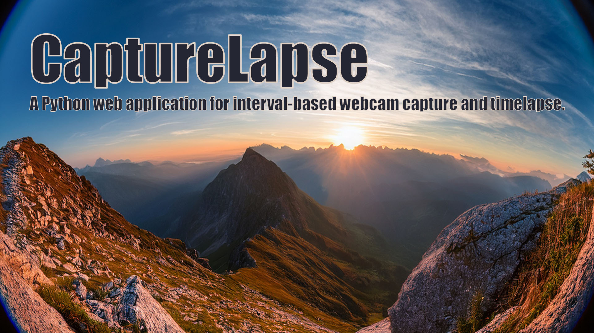

# CaptureLapse 



## Table of Contents
- [Overview](#overview)
- [Using the App](#using-the-app)
  - [Dashboard](#dashboard)
  - [Settings](#settings)
  - [Scheduling](#scheduling)
- [Quickstart](#quickstart)
- [Run (API + Web UI)](#run-api--web-ui)
  - [Endpoints](#endpoints)
- [Configuration](#configuration)
- [What's New (v2.3.3)](#whats-new-v233)
- [Project Layout](#project-layout)
- [Docker Compose](#docker-compose)
  - [Linux Quick Start (Docker Compose)](#linux-quick-start-docker-compose)
- [License](#license)

## Overview
CaptureLapse is a tool for automatically capturing images from a webcam at regular intervals. Users can define the recording schedule - including specific days, time ranges, or daylight-only operation - making it ideal for outdoor time-lapse documentation, such as construction site monitoring. Its primary purpose is to simplify long-term visual tracking by automating image capture and organization.

## Using the App
CaptureLapse runs entirely in the browser. The UI has two pages: the **Dashboard** and **Settings**.

### Dashboard
- Live preview of the latest image and the last capture time
- Current status (running/paused/waiting) and next scheduled capture time
- Sunrise/sunset display when Astral is enabled
- Actions: `Pause`, `Resume`, and `Snapshot`

### Settings
- Camera URL and authentication: snapshot URL plus optional Basic/Digest credentials.
- Capture interval and schedule window: how often to take images and between which times.
- Optional date range (start/end): limit recording to a defined period.
- Days of week selection: choose which weekdays are active.
- Astral (sunrise/sunset) restriction: capture only between sunrise and sunset.
- Language, timezone, and location: UI language and the location used for Astral.

### Scheduling
CaptureLapse decides whether to capture based on:
- Interval (`interval_seconds`)
- Active window (`active_start` / `active_end`)
- Optional date range (`schedule_start_date` / `schedule_end_date`)
- Active weekdays (`active_days`)
- Optional Astral window (sunrise/sunset)

Tip: Setting `Start Time` and `End Time` to the same time (e.g. `00:00` to `00:00`) means 24/7 capture unless Astral is enabled.

## Project Layout
- `app/` - Application code (FastAPI + templates + static assets)
- `app/static/js/` - Frontend scripts (shared helpers, dashboard, settings)
- `app/templates/` - Jinja2 templates for pages
- `app/data/config.json` - Runtime configuration (local default)

## Quickstart
- Prerequisites: Python 3.10+
- Download project
  ```
  git clone https://github.com/der-pw/capturelapse.git
  cd capturelapse
  ```
- Create a virtual environment
  - Windows PowerShell: `py -3 -m venv .venv && .venv\\Scripts\\Activate.ps1`
  - macOS/Linux: `python3 -m venv .venv && source .venv/bin/activate`
- Install dependencies: `python -m pip install -r requirements.txt`

## Run (API + Web UI)
- Development (auto-reload): `uvicorn app.main:app --reload --port 8000`
- Production (example): `uvicorn app.main:app --host 0.0.0.0 --port 8000`
- Open: http://127.0.0.1:8000/

### Endpoints
- `GET /` - Dashboard (templates + static)
- `GET /events` - Server-Sent Events for live updates
- `GET /gallery` - Image gallery (filterable thumbnails)
- `GET /settings` - Settings page
- `GET /status` - JSON status for UI
- `POST /update` - Save settings (form submit)
- `POST /action/{pause|resume|snapshot}` - Control actions

### Frontend behavior
- Dashboard uses **Server-Sent Events** for live status updates with automatic reconnection and falls back to periodic polling when needed.
- Action buttons (`Pause`, `Resume`, `Snapshot`) call the API via `fetch` and surface inline success/error alerts without a page reload.
- Settings are saved via AJAX (`fetch` on the settings form) so inline validation messages appear without navigating away from the page.
- Shared helpers for fetch + alerts live in `app/static/js/app.js`, while page-specific logic is in `dashboard.js` and `settings.js`.
  - After saving, the settings page reloads after a short delay so language changes apply immediately.

## Configuration
- File: `app/data/config.json` (local), `/data/config.json` (Docker)
- Keys (subset):
  - `cam_url`: string; webcam snapshot URL
  - `username` / `password`: optional, for `basic`/`digest` auth
  - `auth_type`: `none` | `basic` | `digest`
  - `save_path`: directory to store snapshots (default `./pictures`, relative to the pictures root)
  - `interval_seconds`: polling interval for snapshots
  - `active_start` / `active_end`: HH:MM window for activity
  - `active_days`: list like `["Mon", "Tue", ...]`
  - `use_astral`: bool; restrict by sunrise/sunset
  - `city_lat` / `city_lon` / `city_tz`: location + timezone settings (used for schedules and status time)
  - `language`: `de` or `en` (templates/i18n)
  - `paused`: bool; persists pause/resume state across restarts
  - `access_password`: optional; if set, the UI requires a login (leave empty to disable)

Environment overrides:
- `CAPTURELAPSE_DATA_DIR`: optional env var to override where `config.json` is stored
- `CAPTURELAPSE_PICTURES_DIR`: optional env var to override the pictures root

## What's New (v2.3.3)
- Treat `00:00` to `00:00` as a full-day capture window.
- Next snapshot calculation respects full-day windows.

## Project Layout
- `app/` - Application code (FastAPI + templates + static assets)
- `app/static/js/` - Frontend scripts (shared helpers, dashboard, settings)
- `app/templates/` - Jinja2 templates for pages
- `app/data/config.json` - Runtime configuration (local default)


## Docker Compose

Use Docker Compose to run CaptureLapse with persistent storage.

Basic File `docker-compose.yml`:

```yaml
services:
  capturelapse:
    container_name: capturelapse
    image: derpw/capturelapse:latest

    restart: unless-stopped

    ports:
      - "8000:8000"

    volumes:
      - ./data:/data
      - ./pictures:/pictures
    environment:
      TZ: "Europe/Berlin"
      UVICORN_LOG_LEVEL: "warning" # debug | info | warning | error | critical
      CAPTURELAPSE_DATA_DIR: "/data"
      CAPTURELAPSE_PICTURES_DIR: "/pictures"

    user: "1000:1000"
```

Notes:
- `8000:8000` maps the container's web UI to host port 8000.
- `./data:/data` persists captured images/config outside the container.
- `UVICORN_LOG_LEVEL` controls Uvicorn log verbosity (e.g., `warning`, `info`).
- `CAPTURELAPSE_DATA_DIR=/data` (optional) forces config storage in the mounted volume.
- `./pictures:/pictures` should be a persistent path (like `./data:/data`) to avoid losing snapshots on container recreation.
- `./pictures:/pictures` stores snapshots outside the container (can be a NAS/network mount).
- The image runs as `appuser` by default, but the Compose example overrides this with `user: "1000:1000"` for host mounts.
- Adjust `TZ` to your timezone and `user` to the correct UID:GID.

### Linux Quick Start (Docker Compose)

- Create project folder and enter it (e.g. in /opt/docker):
  - `sudo mkdir -p capturelapse && cd capturelapse`
- Create `docker-compose.yml` in this folder with the content above.
- Create data folders and set ownership (adjust UID:GID as needed):
  ```
  sudo mkdir -p data pictures
  sudo chown -R 1000:1000 data
  sudo chown -R 1000:1000 pictures
  ```
- Pull images: `docker compose pull`
- Start in background: `docker compose up -d`
- Open the UI: `http://<your-dockerhost>:8000`

Preparation notes:
- The container runs as `1000:1000` in the example. Ensure the host `data/` folder is writable by that UID:GID.
- If you want to run as a different user, change `user:` and align ownership with `chown`.
- `data/config.json` will be created on first start; `pictures/` is where snapshots are stored.


## License
This project uses the MIT License. See `LICENSE` for details.


